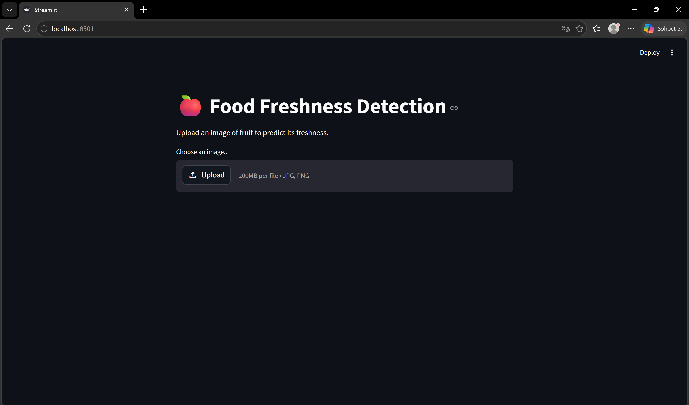
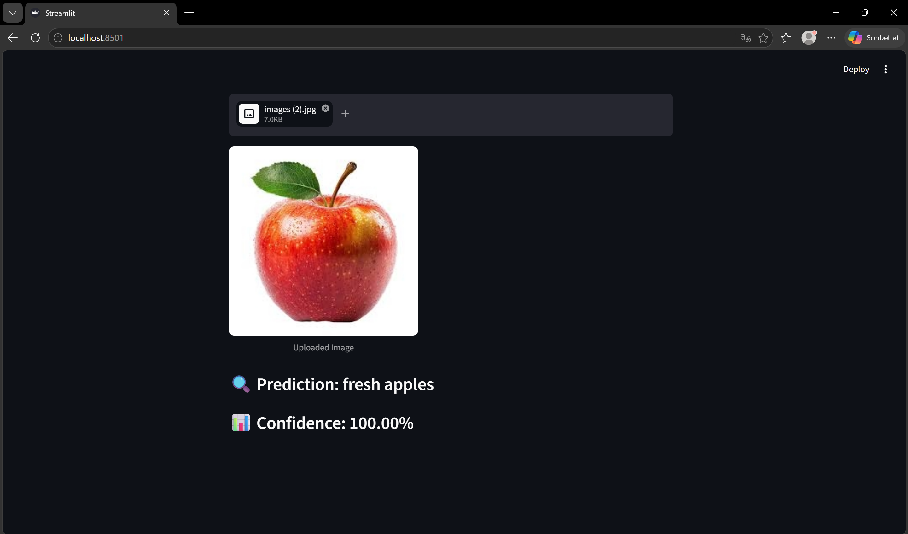
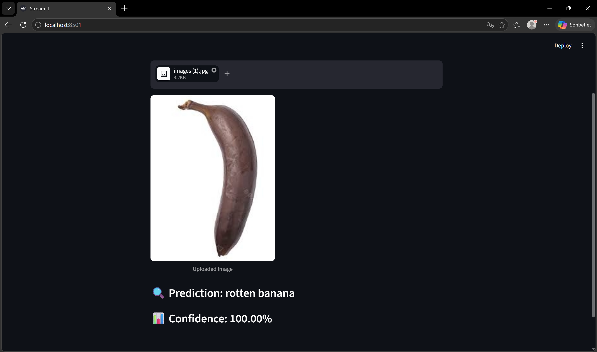
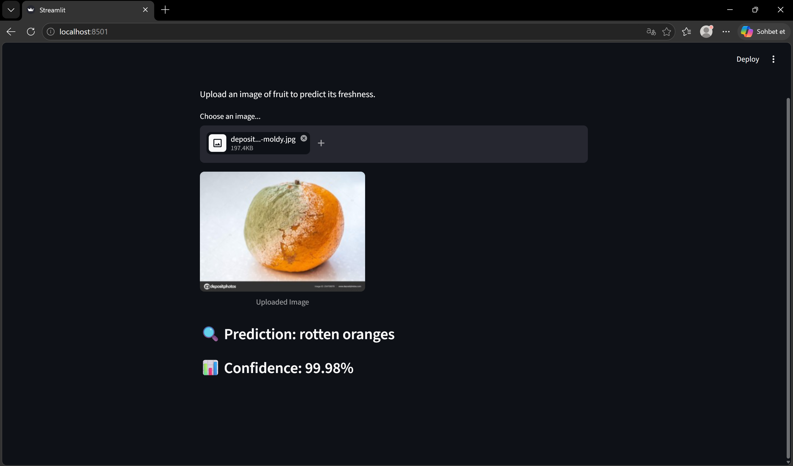

# 🍎 Food Freshness Detection

A deep learning–powered web application that classifies fruit images as **fresh** or **rotten** using transfer learning with MobileNetV2. Built with TensorFlow and Streamlit.



---

## 📌 Overview

Upload a photo of a fruit and the model instantly predicts whether it is fresh or rotten, along with a confidence score. The model currently supports three fruit types:

| Fruit | Fresh | Rotten |
|-------|-------|--------|
| 🍎 Apple | ✅ | ✅ |
| 🍌 Banana | ✅ | ✅ |
| 🍊 Orange | ✅ | ✅ |

---

## 📸 Screenshots

**Fresh apple detected:**



**Rotten banana detected:**



**Rotten orange detected:**



---

## 🧠 Model Architecture

The model uses **MobileNetV2** as a frozen feature extractor (pretrained on ImageNet), with a custom classification head:

```
MobileNetV2 (pretrained, frozen)
        ↓
GlobalAveragePooling2D
        ↓
Dense(256, ReLU)
        ↓
Dropout(0.5)
        ↓
Dense(6, Softmax)   → 6 classes
```

**Training details:**
- Input size: `224 × 224 × 3`
- Optimizer: Adam (`lr = 0.0005`)
- Loss: Categorical Crossentropy
- Epochs: 6
- Batch size: 16
- Validation split: 20%

**Data augmentation applied during training:**
- Random rotation (±20°)
- Width/height shift (10%)
- Zoom (10%)
- Horizontal flip

---

## 🗂️ Project Structure

```
FoodFreshnessDetection/
├── data/                       # Training images (6 class folders)
│   ├── freshapples/
│   ├── freshbanana/
│   ├── freshoranges/
│   ├── rottenapples/
│   ├── rottenbanana/
│   └── rottenoranges/
├── model/
│   └── food_freshness_model.keras
├── app.py                      # Streamlit web application
├── model_cnn.py                # MobileNetV2 model definition
├── preprocess.py               # Data loading & augmentation
├── train.py                    # Training script
├── predict.py                  # Single-image inference script
└── requirements.txt
```

---

## 🚀 Getting Started

### Prerequisites

- Python 3.8+
- pip

### Installation

```bash
git clone https://github.com/mustafabilghn/FoodFreshnessDetection.git
cd FoodFreshnessDetection
pip install -r requirements.txt
```

### Run the Web App

```bash
streamlit run app.py
```

The app will open at `http://localhost:8501`. Upload a JPG or PNG image of an apple, banana, or orange to get a prediction.

### Train the Model

If you want to retrain the model with your own data, organize your dataset into the folder structure shown above, then run:

```bash
python train.py
```

The trained model will be saved to `model/food_freshness_model.keras`.

---

## 🛠️ Tech Stack

| Component | Technology |
|-----------|-----------|
| Deep Learning | TensorFlow / Keras |
| Base Model | MobileNetV2 (ImageNet) |
| Web UI | Streamlit |
| Image Processing | Pillow, NumPy |
| Language | Python 3 |

---

## 📦 Requirements

```
tensorflow
streamlit
numpy
Pillow
```

---

## 📄 License

This project is open source and available under the [MIT License](LICENSE).
